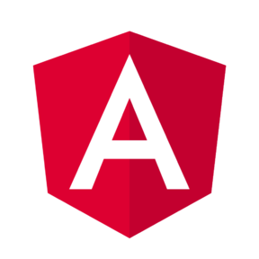

<h1 align='center'></h1>

## 📝 Table of Contents
- [Bio](#bio)
- [Stats](#stats)
- [Social Media](#socialMedia)

## Bio

I'm a self-motivated, creative, and resourceful Full Stack Web Developer who is proficient in JavaScript, Python, React, Angular, Node, Express and experienced with REST APIs. I  love working with collaborative teams that fuel his love for building interactive experiences and problem solving. I also used to work at MPC New York as a Asset Supervisor, taught as an Adjunct Professor at NYU, contributed to Motionographer, developed game prototypes at Disney Interactive and much more.

<h4>Coding Skills:</h4>
<code></code>
<code></code>
<code></code>
<code></code>
<code></code>
<code></code>
<code></code>
<code></code>
<code></code>
<code></code>
<code></code>
<code></code>

## Stats

 

  
  

## Social Media

  

  

  

<h4>3D Skills:</h4>
<ul>
  <li>Animation</li>
  <li>Rendering</li>
  <li>Lighting</li>
  <li>Modeling</li>
  <li>High-poly modeling</li>
  <li>Low-poly modeling</li>
  <li>Scripting</li>
  <li>Prop Modeling</li>
  <li>Environment Modeling</li>
  <li>Texturing</li>
  <li>Previs</li>
  <li>Rigging</li>
</ul>
<!--
**AndresMWeber/AndresMWeber** is a ✨ _special_ ✨ repository because its `README.md` (this file) appears on your GitHub profile.

Here are some ideas to get you started:

- 🔭 I’m currently working on ...
- 🌱 I’m currently learning ...
- 👯 I’m looking to collaborate on ...
- 🤔 I’m looking for help with ...
- 💬 Ask me about ...
- 📫 How to reach me: ...
- 😄 Pronouns: ...
- ⚡ Fun fact: ...
-->
